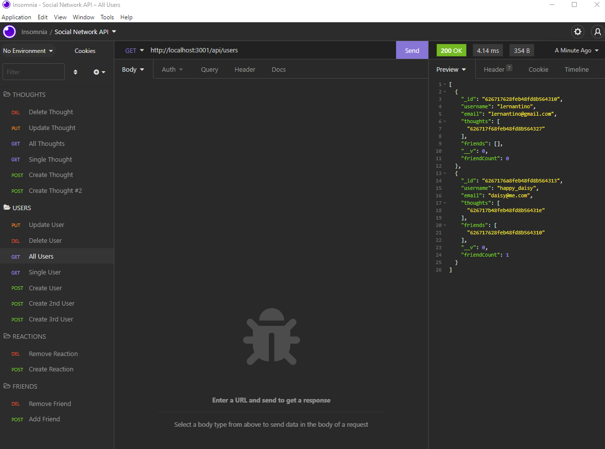

# a-penny-for-your-thoughts
Social Network API

# Description
I built the back end for an social media site called A Penny For Your Thoughts. Routes were created for each of the following actions:

Users:
  - Create an account
  - Update username 
  - Delete their account

Thoughts:
  - Create a thought
  - Update thought 

Reactions:
  - Create a reaction
  - Delete reaction 

Friends:
  - Add a friend
  - Delete a friend 

[link to GitHub repository](https://github.com/Ro-Galvan/a-penny-for-your-thoughts)

[video demo -part 1](https://drive.google.com/file/d/1Dt3W-V7QseLCvClvXCA0cNiS7SSBU7fE/view)

[video demo -part 2](https://drive.google.com/file/d/1ghLnfwvTgpq7sBk-yB4z4s2z_RSu3oAy/view)

# Table of Contents
  - [Installation](#installation)
  - [Usage](#usage)
  - [License](#license)
  - [Questions](#questions)

# Installation
  Install the below packages/modules from node.js by running `npm install` :
- mongoose 

   **if you don't have mongoDB installed, make sure to install it first

- express
- Run `npm start` or `nodemon` to start the application and to test and seed (enter in insomnia manually) the database go to Insomnia
- After you seed your db in Insomnia you can always go to MongoDb Compass to clear it or directly from the VS terminal by entering `mongo` and entering the appropriate commands.
- To exit out of the application, type `Ctrl + C` for windows or `Command + C`

# Usage

# License
 MIT

# Questions
  Link to my github:
  https://github.com/Ro-Galvan
